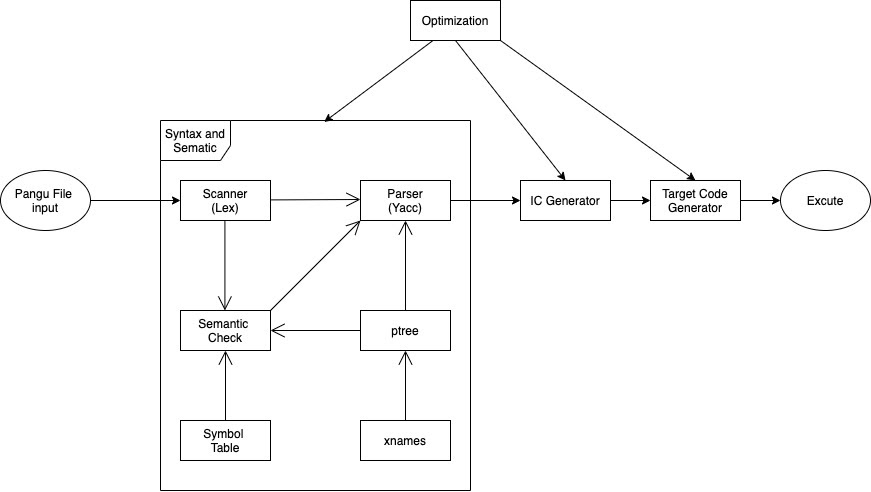

# CS4ZP6 Capstone Group 4 Project Documentation
Lexical, Syntax and Semantic Modules for Pangu Compiler in Python
**Supervisor:** Prof. Franek
April 2020

| **Name** | **Email** |
| --- | --- |
| Yujing Chen | cheny48@mcmaster.ca |
| Ziqing(Amy) Xu | xuz69@mcmaster.ca |
| Baikai Wang | wangb40@mcmaster.ca |
| Wei Jiang | jiangw41@mcmaster.ca |
| Quan(Steve) Man | manqz@mcmaster.ca |

## Table of Contents
- 1. Description
- 2. Software Requirement Specification
   - 2.1 Purpose
   - 2.2 Definitions
   - 2.3 Background
   - 2.4 References
- 3. Overall Description
   - 3.1 Product Perspective
   - 3.2 Design Constraints
      - 3.2.1 Operations
      - 3.2.2 Site Adaptation Requirements
   - 3.3 Product Functions
      - 3.3.1 Lexical Analysis
      - 3.3.2 Syntax and Grammar Validation
      - 3.3.3 Abstract Syntax Tree Construction
      - 3.3.4 Symbol Table Generation
   - 3.4 User Characteristics
   - 3.5 Constraints, Assumptions and Dependencies
- 4. Specific Requirement
   - 4.1 External Interface Requirements
   - 4.2 Functional Requirements
   - 4.3 Performance Requirements
   - 4.4 Software System Attributes
      - 4.4.1 Reliability
      - 4.4.2 Availability
      - 4.4.3 Security
      - 4.4.4 Maintainability
      - 4.4.5 Portability
   - 4.5 Functional Requirements
      - 4.5.1 Use Case for Writing Source Code
      - 4.5.2 Use Case for Compiling
- 5. Software Design/Architecture
   - 5.1 Interface Viewpoint
      - 5.1.1 Software Interface
      - 5.1.2 Command Line Interface (CLI)
   - 5.2 Structure Viewpoint
   - 5.3 Interaction Viewpoint
   - 5.4 Algorithm Viewpoint
   - 5.5 Resource Viewpoint
- 6. Code Guide
   - 6.1 Prerequisites
   - 6.2 How to Run
   - 6.3 Syntax of the Command Line
   - 6.4 Testing Flags

## 1. Description

The proposed system is a Python based compiler for Pangu. Pangu is an imperative
programming language similar to Java or C++ designed at McMaster University by
professors Franek and Liut to manage memory through the machinery of primary and
secondary references. The compiler is proposed to be a stand-alone program used in
Linux environment as a command line invocation. The compiler will translate the
Pangu source code to the target code PIC which is in fact a lower level intermediate
code. First, a parser generated by PLY (Python Lex-Yacc) will translate Pangu source
code into an abstract syntax tree. Then the abstract syntax tree will be transformed in
several steps into the target code PIC. The PIC file will be interpreted by an
interpreter which is not a part of this project and will be facilitated by our supervisor
Prof.Franek. At this stage, we have accomplished the lexical, syntax and semantic
modules for the Pangu compiler and code generator module will be implemented in
further steps.

## 2. Software Requirement Specification
### 2.1 Purpose

This document will serve to document and formalize the requirements of the Pangu
interpreter.

### 2.2 Definitions

| Word/Phrase | Definition |
| --- | --- |
| Abstract Syntax Tree | abstract syntactic structure of source code |
| Pangu | new language developed at McMaster which handles emphasizes on handling memory allocation/deallocation using primary references |
| PIC | lower level intermediate code that is then translated into machine code |
| Symbol table | a data structure where each identifier in a program&#39;s source code is associated with information relating to its declaration or appearance in the source |

### 2.3 Background

This documentation is only for the​ lexical, syntax and semantic modules of the Pangu
compiler.

### 2.4 References
[1] &quot;sys - System-specific parameters and functions¶,&quot; _sys - System-specific parameters and functions - Python 3.8.2 documentation_. [Online]. Available: https://docs.python.org/3/library/sys.html. [Accessed: 26-Apr-2020].

[2] _PLY (Python Lex-Yacc)_. [Online]. Available: https://www.dabeaz.com/ply/ply.html. [Accessed: 26-Apr-2020].

[3]830-1998 — IEEE Recommended Practice for Software Requirements Specifications. 1998. doi:10.1109/IEEESTD.1998.88286. ISBN 978-0-7381-0332-7

[4]F. Franek and M. Liut, _Designing and implementing a compiler_. Unpublished manuscript. Hamilton, Ontario, 2019.

## 3. Overall Description

### 3.1 Product Perspective
There are 3 main modules: pangulex, panguyacc and panguseman. Pangulex is the scanner/tokenizer and passes tokens to panguyacc which parses the tokens into an Abstract Syntax Tree. Then finally, panguseman will perform semantic checks with the help of pangusymtab which contains the symbol table. The symbol table is created and maintained by the interpreter.

Users can interact with the program via Command Line by entering &quot;python3 panguyacc.py name\_of\_test\_file.asc&quot;. The parser will then output the parsed results of the selected file if successful or returns some errors.

If the parsing was successful, an abstract data tree of the Pangu source code will be produced. Then the abstract syntax tree will be transformed in several steps including some optimization into PIC. The PIC file will be interpreted (executed) by an interpreter which is not a part of this project.

### 3.2 Design Constraints

#### 3.2.1 Operations

The program should be able to take a Pangu program in a .asc file and perform
lexical, syntax and semantic analysis on it within a reasonable time period. It should
detect and report any illegal characters, syntactical and/or semantic errors in the
source program. If there is no error, the program should show all tokens/productions,
build/show an abstract syntax tree, and/or build/show a symbol table if the user
chooses to do so by setting corresponding flags.

#### 3.2.2 Site Adaptation Requirements

The program should be system independent and it should run correctly in a terminal
or Windows command prompt.

### 3.3 Product Functions

#### 3.3.1 Lexical Analysis

Given an input Pangu program, the pangulex.py module can break the input program
into a collection of tokens defined by a set of regular expression rules, which can be
used by other modules. The generated tokens can be displayed by setting
_pangulex.y_show_tokens_ ​ flag in ​ _panguyacc.py_ ​ module to ​ _True_ ​. Comments can be
shown by setting the ​ _y_pangulex.y_show_comments_ ​ flag in ​ _panguyacc.py_ ​ module to

_True_ ​. It can also detect and report any illegal characters that are not specified by the
set of regular expression rules.

#### 3.3.2 Syntax and Grammar Validation

The program performs syntax and grammar validation on the input Pangu program
based on predefined BNF grammars. Syntax errors can be detected and reported by
the program. If there is no error, all the production rules involved in the input Pangu
program can be shown by setting the ​ _y_show_productions_ ​ flag in ​ _panguyacc.py_
module to ​ _True_ ​.

#### 3.3.3 Abstract Syntax Tree Construction

An abstract syntax tree of the input Pangu program can be constructed and
displayed. The abstract syntax tree provides the abstract syntactic structure of the
input program. It can also be used to generate a symbol table.

#### 3.3.4 Symbol Table Generation

A symbol table keeps track of declared identifiers and their various attributes such as
scope, kind, and so on. It is used in semantic analysis to make sure all the identifier
names used in the input program are uniquely declared before use and they are
correctly used in terms of scope and type.

### 3.4 User Characteristics

Users of the program are those who perform lexical, syntactical and/or semantic
analysis on a Pangu program and/or those who continue to build a compiler for
Pangu. They are expected to be familiar with Pangu and Python3 so that they can
use this program based on their needs by modifying the flags in ​ _panguyacc.py_ ​. For
example, if they only need to see the abstract syntax tree, they can set the flags
_y_build_ptree_ ​ and ​ _y_show_ptree_ ​ to ​ _True_ ​ and others to ​ _False._

### 3.5 Constraints, Assumptions and Dependencies

The program is designed to run in a terminal or Windows command prompt. It
requires Python 3.8 or later and a Python PLY-3.11 package to be installed. The input

### file with .asc extension has to be placed in the same directory as this program.

## 4. Specific Requirement

### 4.1 External Interface Requirements

This section provides information of the requirements needed to ensure that the
system will communicate properly with external components. Two main required
external interfaces are user interface and software interface. Firstly, in our project, the
command line interface is chosen as the user interface. Users can communicate
through using codes in a command facilitated by the CLI (such as terminal). More
details about the command line interface will be discussed in Interface Viewpoint in
the Software Design section. Also, the syntax of all the commands are known to the
users which will be discussed in the Code Guide section. Then, let’s discuss the
software interface requirement. The compiler is proposed to be a stand-alone
program used in the Linux environment using a command line invocation. Then, PLY
(Python Lex-Yacc) which is a parsing tool is needed for implementing lexical and
syntax modules of the compiler. Thus, CLI, Linux OS and PLY are the two main
external interface requirements in this project.

### 4.2 Functional Requirements

In this section, general functional requirements will be discussed. And functional
requirements will be more specifically discussed in section 3.5. The main and intuitive
function of the compiler is to translate the Pangu source code into the target code PIC
which is in fact a lower level intermediate code. First, a parser generated by PLY
(Python Lex-Yacc) will translate Pangu source code into an abstract syntax tree.
Then the abstract syntax tree will be transformed in several steps including some
optimization into PIC. The PIC file will be interpreted (executed) by an interpreter
which is not a part of this project and will be facilitated by our supervisor Prof. Franek.
At this stage, unfortunately, we have only finished lexical, syntax and semantic
modules of the Pangu compiler but have not accomplished type checking and the
code generator. Implementing type checking, code generator and some optimizations
are the further steps for this project.

### 4.3 Performance Requirements

In this section, some performance requirements will be discussed. In this project, the
performance of intelligent error messaging of the compiler takes precedence over the
speed performance, however one-pass approach should be maintained. For example,

the compiler will stop and return an error message if there is a syntax or discernible
semantic error in the source code. Therefore, at this stage, no error recovery ability
will be built into the compiler. Further, some optimizations (such as abstract syntax
tree, immediate code and target code optimizations) are expected to be done in
further steps for improving the performance of the system.

### 4.4 Software System Attributes

The following attributes are what we expect for the future Pangu compiler.

#### 4.4.1 Reliability

Pangu compiler must be able to correctly recognize and convert the Pangu code into
target code, despite length and indentation of the Pangu code. No ambiguity in the
Pangu code is allowed. The compiler needs to define whether an input code is valid
or contains error. Only completely valid code will be converted to target code.
Whenever an error is found in the input Pangu code, the compiler must terminate and
report its type and position to users.

#### 4.4.2 Availability

Pangu compiler must be available to users all the time. When the Pangu compiler is
updated to a new version, its old version still needs to be available to users and able
to work correctly.

#### 4.4.3 Security

The whole transformation detail in Pangu compiler must be protected from modifying
by users. Only an application programming interface for input Pangu code will be
provided. Users must not have any other access to the source code.

#### 4.4.4 Maintainability

All versions of Pangu compiler need to be carefully documented. It needs to have a
logging to keep track of bugs encountered by users. It needs to allow recovery from
exceptional events without intervention by ​technical support​ staff [3].

#### 4.4.5 Portability

Pangu compiler should be able to work on Mac, Linux and Windows platforms.
Currently, as the project only reached syntax and semantics checking stage, and
python ply is using for the current stage, it can work on all the platforms with python
installed.

### 4.5 Functional Requirements

Currently, we have completed lexical, syntax and semantic modules for Pangu
Compiler. Hence, the following use case specification section presents the functional
requirements for Pangu Compiler that we have done so far.

#### 4.5.1 Use Case for Writing Source Code

| Use Case | Writing Source Code |
| --- | --- |
| Actors | Users, asc file (pangu source code file with extension .asc) |
| Goal Description | Users can write a pangu source code in an asc file, then run the file in the command line. |
| Precondition | Users have downloaded the Pangu compiler and PLY(Python Lex-Yacc). |
| Step-by-Step Description | 1. Users open a txt file; 2. Writing source code in the txt file; 3. Saving the source code file with .asc extension; 4. Opening the terminal; 5. Running program in command line.
|Postcondition | Users saved the source code in asc file format. |
| Exceptions | Users run the source code file with the correct format in the command line. |

#### 4.5.2 Use Case for Compiling

| Use Case | Compiling |
| --- | --- |
| Actors | Terminal, and the Pangu compiler |
| Goal Description | The final goal is that the compiler will translate the source code to the immediate code PIC(a lower level intermediate code). At this stage, it will only display parse trees, production, and symbol tables since we only finished building the lexical, syntax and semantic modules for Pangu Compiler. |
| Step-by-Step Description | All the Steps are done by the compiler: 1. A parser generated by PLY (Python Lex-Yacc) will translate Pangu source code into an abstract syntax tree and display it in the terminal. 2. It also gives the production of parsing bases on the Pangu Syntax. 3. Displaying the symbol table for the semantic module.|
| Exceptions | The source code follows the Pangu syntax and semantic module, otherwise errors will arise in the terminal. |

## 5. Software Design/Architecture

### 5.1 Interface Viewpoint

#### 5.1.1 Software Interface

Figure 1.1 : Software Interface
The above figure 1.1 shows a set of interface specifications for each entity required in
the program and how the cooperating entities will interact with each other. The three
main modules of our program are ​ **_pangulex_** ​, ​ **_panguyacc_** ​ and ​ **_panguseman_** ​ which
are for tokenizing, parsing and semantic checking respectively. Also, we used the
PLY parsing tool in ​ _pangulex_ ​ and ​ _panguyacc_ ​ modules. In addition, ​ _pangusymtab_ ​,
_xnames_ ​ and ​ _ptree_ ​ modules are required for implementing the lexer, parser and
semantic checking. More details will be discussed in the structure and interaction
viewpoint section.

#### 5.1.2 Command Line Interface (CLI)

Figure 1.2 : command line interface
The above figure 1.2 shows how to run the program. Open terminal and go to the
directory which contains all the program source code. Then run ​ _panguyacc.py_ ​ with

the command line argument ​ _test1.asc_ ​ which is the name of the pangu source file. The
content of the output will be different based on the flag which can be modified in the
panguyacc.py. For example,

​Figure 1.3 : Pangu Source Code

​Figure 1.4 : Source Code deparsed from AST
The origin source code (figure 1.2) and deparsed code (figure 1.3) from the AST could be displayed for checking the parsing step if ​ **_y_deparse_ptree_** ​ flag is set to True.

​Figure 1.5 : Symbol Table

Figure 1.6
The above figure shows part of the symbol table (figure 1.4) , where the variable is defined in the pangu program and what type the variable is for checking the semantic module (figure 1.5) since ​ **_y_show_symbol_table_** ​ flag is set to True. Also, the AST can be displayed if the variable ​ **y_show_ptree** ​ flag in panguyacc.py is set to True.

### 5.2 Structure Viewpoint

#### Figure 2: Structure Viewpoint

Internally, a Pangu compiler includes the syntax and semantic check, intermediate code(IC) generator, target code generator and optimization. Our project currently covers the syntax and semantic check part of the Pangu compiler, which is shown in the frame of the above figure. The semantic check module still needs further implementation.

The function of each module is described as follow:

- Scanner(Lex): Lex is used to tokenize an input string. For example, if you have a line of pangu code &quot;int out = 1;&quot;, you need to split it into individual tokens {&quot;int&quot;, &quot;out&quot;, &quot;=&quot;, &quot;1&quot;, &quot;;&quot;}. Python RE is used to recognize the token.

- Parser(Yacc): Yacc is used to analyze the grammar structure of Pangu code, and record the structure for future use.
- ptree: ptree is an abstract syntax tree built to record the grammar structure of the Pangu code.
- xnames: xnames converts a grammar type name to integer.
- Symbol Table: Symbol Table is used to record the variables information of Pangu code. Each variable will have its id, scope, kind, type, signature and position information recorded.
- Semantic Check: Semantic check is used to analyze the semantic aspect of the source code. Including checking and determining scopes of names , binding of names, types of expressions, call signatures, flow-of-control, etc.
### 5.3 Interaction Viewpoint

**Figure 3:** Interaction Viewpoint
**# 1**
_Figure 3 shows the interactions among different components of the program. Scanner takes a Pangu program as input and generates tokens for Parser and Parser can call Scanner to get the next token. While parsing, Parser constructs an Abstract Syntax Tree (AST), which can be used to generate a Symbol Table. The Symbol Table is used for type checking by the Parser._

### 5.4 Algorithm Viewpoint

Panguseman.py

Symtab\_check() performs a check on id and will return True if the symbol already exists and is within the current scope. Otherwise, it returns False.

Get\_sign() and get\_sign2() returns the signature of the node.

Sub\_seman() takes care of managing the scope\_stack array and also checks the validity of identifiers based on its scope and existence in the symbol table.

Pangulex.py

Is\_protected() and is\_reservered() both checks the inputs againsts reserved or protected strings and returns a boolean.

Pangulex.py contains many functions that identify the different types of tokens. For example, t\_ASSIG(t) will match with the &quot;=&quot; and will print the token if needed. Printing of tokens is used primarily for code testing.

Panguyacc.py

panguyacc.py&#39;s goal is to parse the tokens that are coming in from the scanner into an Abstract Syntax Tree.

Each method builds one specific node of the tree and updates the pline and ppos value of each node accordingly. Some methods also update the value of nodes with typing information and children.

Ptree.py

This contains the class Node and its methods. There are a couple of show methods that are used for printing out the parsetree:

attach(self,\*argv): attaches all nodes as children

cond\_attach(self,\*argv): only attaches nodes that are leaves (no children)

prettach(self,\*argv): removes all nodes(children)

deparse(self): checks the id of the node and builds a parse tree using tokens. It also calls upon dd(self) and dd1(self,i) to break down expressions

SymbolTab.py

Pangusymtab.py contains classes Symbol and SymbolTab.

Symbol requires the following attributes to be created: name, scope and kind. It can also include type,pline and ppos.

SymbolTab is the class object for the symbol table. The insertSymbol() function is for new entries in the symbol table and showtab() will print the table. SymbolTab also contains a variety of methods that can check different properties of objects and will return the entry&#39;s index if found. It can check if a classname is valid, if a variable is within scope, if a method is valid and more.

xnames.py

It translates grammar types into an integer.

### 5.5 Resource Viewpoint

There are the resources we used to develop our project:

1. Python
  1. Python is a high level programming language that we use to design the lexical, syntax and semantic modules of Pangu Compiler.
2. System-specific parameters and functions module in Python (sys)
  1. This module provides access to some variables used or maintained by the interpreter and to functions that interact strongly with the interpreter.
  2. More specifically, we only used **sys.exit(0)** in our programming. It means exit from Python. This is implemented by raising the [SystemExit](https://docs.python.org/3/library/exceptions.html#SystemExit) exception, so cleanup actions specified by finally clauses of [try](https://docs.python.org/3/reference/compound_stmts.html#try) statements are honored, and it is possible to intercept the exit attempt at an outer level.
3. Python Lex-Yacc (PLY)
  1. PLY is an implementation of lex and yacc parsing tools for Python.
  2. The reason why we choose PLY for our compiler is that PLY uses LR-parsing which is reasonably efficient and well suited for larger grammars, and it provides most of the standard lex/yacc features including support for empty productions, precedence rules, error recovery, and support for ambiguous grammars.

## 6. Code Guide

### 6.1 Prerequisites

The following are the softwares, tools or packages needed to be downloaded or/and installed in order to run the program.

- PLY - 3.11 (Python Lex-Yacc) parsing tool
  - version 3.11
  - PLY parsing tool is required to implement the lexical and syntax modules of the project. Thus, PLY is required to be downloaded for running the program
  - Here is the link of the information about how to download the tool: [https://www.dabeaz.com/ply/](https://www.dabeaz.com/ply/)

- Command Line Interface
  - Command Line Interface is needed to run the program
  - For example, on Mac OS, the Mac command line is called &quot;Terminal&quot;; on Windows, it is called &quot;Windows Command Prompt&quot;.
- Python 3.8
  - The whole project is implemented in Python language (version 3.8)
 
### 6.2 How to Run

1. Open the CLI on your computer

Figure 4.1 : CLI

1. Go to the directory which contains all the source code of the program

Figure 4.2 : Targeted Directory

1. Enter the command line as the following:

Figure 4.3 : Command

### 6.3 Syntax of the Command Line

[python3 panguyacc.py pangu\_s\_c]

where pangu\_s\_c is the name of the pangu source code file

### 6.4 Testing Flags

Several testing flags are available, they can be switching on in panguyacc.py

1. Show\_tokens: lexical token in the pangu source code will be printed.

1. Show\_comments: comments will not be hidden in the depares code.

1. Show\_productions: grammar production will be printed.

1. Show\_ptree: AST structure will be printed.

1. Show\_deparse\_tree: code built from deparsing AST will be printed.

1. Show\_symbol\_table: symbol table will be printed.

